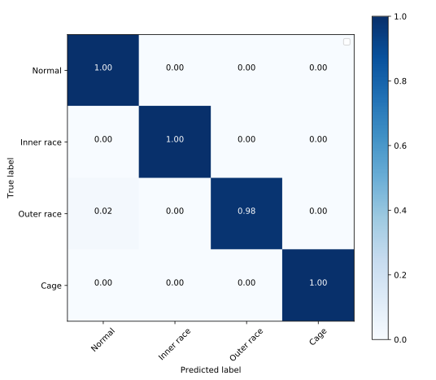
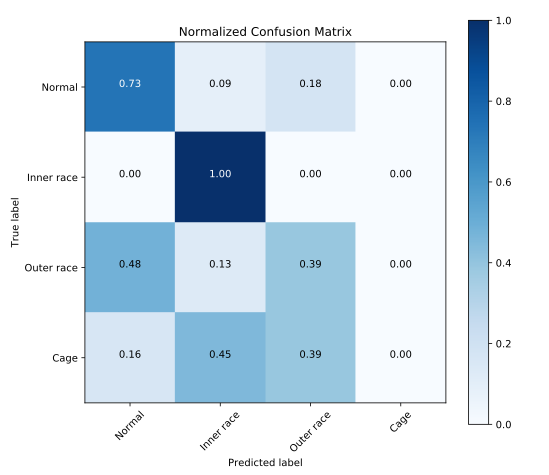

# Prognostic and Remaining Useful Life Prediction of Bearing

This is the project of hybrid prediction based on deep learning technology.

## Key technology

+ Sparse condition encoding method
+ Shared features modeling with fault prognostic and RUL
+ Data reinforcement

## TODO

+ Classification and regression on XJTU bearing dataset
+ Transfer learning appliance
+ Digital twins by Deep Conditional Generative Adversarial Neural Network(DCGAN) 

## Achievements
| Type | Value on Train set | Value on Test set | 
|----|----|----|
| Classification Accuracy(~60 epoch) | ~99.86% | ~70% |

## Confusion matrix

+ On train data 
+ On test data 

## Current difficulty

+ Follow Fast-RCNN architecture to design brand-new model

## LICENCE

Project is licensed [MIT](./LICENSE), and XJTU Bearing data is copyrighted by [Biao Wang of Xi'an Jiaotong University](http://biaowang.tech/xjtu-sy-bearing-datasets/)